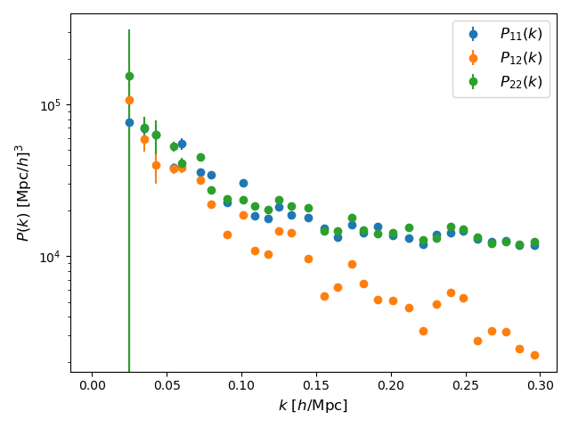

.. _tutorials/multi_hod:

HOD for multiple tracers
========================

In this tutorial, we will generate a catalogue with two types of galaxies tracing the same density field. We are going to use the `halo occupation distribution (HOD) <https://arxiv.org/abs/astro-ph/0408564>`_ with the extension for two tracers presented in appendix C `here <https://arxiv.org/abs/2108.11363>`_. We are going to use the best fit parameters that reproduces the red and blue galaxies of `IllustrisTNG300 <https://www.tng-project.org/>`_.

After reading this, you will learn:

- How to generate a halo catalogue (``pyexshalos.mock.Generate_Halos_Box_from_Pk``);
- How to populate the halo catalogue with a HOD (``pyexshalos.mock.Generate_Galaxies_from_Halos``);
- How to split the galaxies into two populations (``pyexshalos.mock.Split_Galaxies``);
- How to compute the density grid from a list of tracers with their respective types (``pyexshalos.simulation.Compute_Density_Grid``);
- How to compute all possible power spectra from a list of density grids (``pyexshalos.simulation.Compute_Power_Spectrum``);

The ``.py`` file with the full code is in the `github page <https://github.com/Voivodic/ExSHalos/blob/main/tutorials/Multi_HOD.py>`_.

First of all, we need to import numpy, for the manipulation of arrays, pylab, to plot the results, and pyexshalos.

.. code-block:: python

    # Import the libraries used in this tutorial
    import numpy as np
    import pylab as pl
    import pyexshalos as exh

Then, we set the parameters of our box and load the linear matter power spectrum from `MDPL2 simulation <https://www.cosmosim.org/metadata/mdpl2/>`_. We also set the parameters of the barrier to the ones found with ``pyexshalos.utils.Fit_Barrier`` (described in the :ref:`generating a halo catalogue <tutorials/generating_halos>` tutorial).

.. code-block:: python

    # Set parameters for the halo catalogue
    Om0 = 0.307115
    z = 0.0
    Nd = 256
    Lc = 1.0
    L = Lc * Nd
    N_MIN = 1
    SEED = 12345
    VERBOSE = True

    # Load the linear matter power spectrum from the MDPL2 simulation
    klin, Plin = np.loadtxt("MDPL2_z00_matterpower.dat", unpack=True)

    # Best fit parameters found with pyexshalos.utils.Fit_Barrier
    PARAMS = [0.803958, 0.288991, 0.525464]

Now, we use the parameters above to generate a halo catalogue. 

.. code-block:: python

    # Generate a halo catalogue with the barrier define above
    halos = exh.mock.Generate_Halos_Box_from_Pk(
        k=klin,
        P=Plin,
        nd=Nd,
        Lc=Lc,
        Om0=Om0,
        z=z,
        Nmin=N_MIN,
        a=PARAMS[0],
        beta=PARAMS[1],
        alpha=PARAMS[2],
        OUT_LPT=False,
        seed=SEED,
        verbose=VERBOSE,
    )

Once we have the halo catalogue, we can populate it with galaxies. We use the ``pyexshalos.mock.Generate_Galaxies_from_Halos`` function to do so. We use the functional form and parameters from this `paper <https://arxiv.org/abs/astro-ph/0408564>`_. Note that we set ``OUT_FLAG=True``, this outputs the id of the host halo of each galaxy, using negative ids in the central galaxies. 

.. note:: 
    We also have the extra parameter ``sigma`` that sets how the density profile, `NFW <https://arxiv.org/abs/astro-ph/9611107>`_ here, is surpressed for large radii to enforce mass conservation. 

.. code-block:: python

    # Populate the halos with galaxies
    gals = exh.mock.Generate_Galaxies_from_Halos(
        posh=halos["posh"],
        Mh=halos["Mh"],
        nd=Nd,
        Lc=Lc,
        Om0=Om0,
        z=z,
        logMmin=13.25424743,
        siglogM=0.26461332,
        logM0=13.28383025,
        logM1=14.32465146,
        alpha=1.00811277,
        sigma=0.5,
        seed=SEED,
        OUT_VEL=False,
        OUT_FLAG=True,
        verbose=VERBOSE,
    )

The galaxies are then split into two populations using the ``pyexshalos.mock.Split_Galaxies`` function. We use the parameters of the `EFTofLSS analyses with multiple tracerrs <https://arxiv.org/abs/2108.11363>`_ that reproduces the halo occupation distribution of blue and red galaxies of the high-resolution `IllustrisTNG300 <https://www.tng-project.org/>`_ simulation.

.. code-block:: python

    # Split the galaxies into two populations
    gals_types = exh.mock.Split_Galaxies(
        Mh=halos["Mh"],
        Flag=gals["flag"],
        params_cen = np.array([37.10265321, -5.07596644, 0.17497771]),
        params_sat = np.array([19.84341938, -2.8352781, 0.10443049]),
        seed = SEED,
        verbose = VERBOSE,
    )

The density grids and spectra of the tracers are computed using the ``pyexshalos.simulation.Compute_Density_Grid`` and ``pyexshalos.simulation.Compute_Power_Spectrum`` functions. As in the previous tutorials.

.. code-block:: python

    # Compute the density grids
    WINDOW = "CIC"
    INTERLACING = True
    grids = exh.simulation.Compute_Density_Grid(
        pos=gals["posg"],
        types=np.abs(gals_types),
        nd=Nd,
        L=L,
        window=WINDOW,
        interlacing=INTERLACING,
        verbose=VERBOSE,
    )

    # Measure the power spectra
    NK = 32
    K_MIN = 0.0
    K_MAX = 0.3
    P_sim = exh.simulation.Compute_Power_Spectrum(
        grid=grids,
        L=L,
        window=WINDOW,
        Nk=NK,
        k_min=K_MIN,
        k_max=K_MAX,
        verbose=VERBOSE,
        ntypes=2,
    )

Finally, we plot the power spectra.

.. code-block:: python

    # Plot the power spectra
    pl.clf()

    pl.errorbar(P_sim["k"],
                P_sim["Pk"][0],
                yerr=P_sim["Pk"][0]/P_sim["Nk"],
                linestyle="",
                marker="o",
                markersize=6,
                label=r"$P_{11}(k)$",
                )
    pl.errorbar(P_sim["k"],
                P_sim["Pk"][1],
                yerr=P_sim["Pk"][1]/P_sim["Nk"],
                linestyle="",
                marker="o",
                markersize=6,
                label=r"$P_{12}(k)$",
                )
    pl.errorbar(P_sim["k"],
                P_sim["Pk"][2],
                yerr=P_sim["Pk"][2]/P_sim["Nk"],
                linestyle="",
                marker="o",
                markersize=6,
                label=r"$P_{22}(k)$",
                )

    pl.xscale("linear")
    pl.yscale("log")
    pl.xlabel(r"$k$ [$h/$Mpc]", fontsize=12)
    pl.ylabel(r"$P(k)$ [Mpc$/h]^{3}$", fontsize=12)
    pl.legend(loc="best", fontsize=12)

    pl.tight_layout()
    pl.savefig("Multi_hod.png")

.. attention::
    
    Note that the power spectra both tracers are very similar. It happens because our simulation has a very low mass resolution, in comarions to the IllustrisTNG300 simulation. For a fair comparison, we should use the same resolution of the original simulation.
